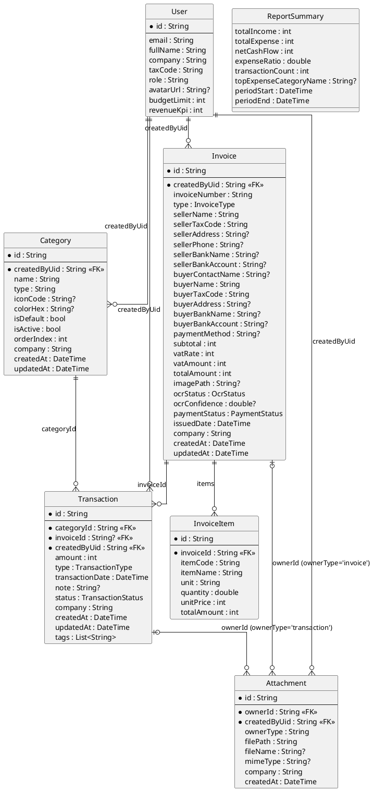

# Entity Relationship Diagram (ERD) cho SmartFinance

Bạn có thể copy đoạn mã PlantUML dưới đây và dán vào draw.io để tự động vẽ ERD:
1. Mở draw.io (app.diagrams.net).
2. Chọn `Arrange` -> `Insert` -> `Advanced` -> `PlantUML...` (hoặc nhấn nút dấu `+` trên thanh công cụ -> `Advanced` -> `PlantUML...`).
3. Dán đoạn code dưới đây vào và bấm `Insert`.

---

## Giải thích Luồng Nghiệp vụ và Vận hành Hệ thống

Dựa vào sơ đồ thực thể liên kết (ERD) ở trên, hệ thống SmartFinance được vận hành với các luồng nghiệp vụ cốt lõi sau:

### 1. Phân quyền và Đa khách hàng (Multitenancy)
- **Thực thể trung tâm:** `User`
- **Quan hệ:** `User` (1) - (N) `Category`, `Invoice`, `Transaction`, `Attachment`
- **Vận hành:** Hệ thống hỗ trợ mô hình công ty hoặc đội nhóm. Mỗi bản ghi dữ liệu được tạo ra (từ danh mục, hóa đơn đến giao dịch) đều bắt buộc gắn với `createdByUid` (người tạo) và `company` (công ty/tổ chức). Điều này giúp hệ thống phân tách dữ liệu an toàn giữa các tài khoản (multitenancy) và dễ dàng truy vết (audit) xem ai là người thực hiện nghiệp vụ.

### 2. Luồng Quản lý Danh mục (Category Management)
- **Quan hệ:** `Category` (1) - (N) `Transaction`
- **Vận hành:** Quản lý tài chính sẽ thiết lập các danh mục thu/chi chung (ví dụ: Tiền thuê nhà, Lương nhân viên, Doanh thu bán hàng). Khi Kế toán nhập một giao dịch, giao dịch đó bắt buộc phải thuộc về một danh mục cụ thể (`categoryId`). Quan hệ này phục vụ trực tiếp cho việc thống kê, vẽ biểu đồ và phân tích dòng tiền theo khoản mục.

### 3. Luồng Quản lý Hóa đơn và Thanh toán (Invoice & Payment Flow)
- **Quan hệ:** 
  - `Invoice` (1) - (N) `InvoiceItem`
  - `Invoice` (1) - (N) `Transaction`
- **Vận hành:**
  1. **Tạo hóa đơn:** Kế toán tạo hóa đơn (đầu vào hoặc đầu ra). Hóa đơn bao gồm thông tin chung (người bán, người mua, thuế VAT, tỷ lệ thuế) và quan hệ 1-N với danh sách các mặt hàng chi tiết (`InvoiceItem`).
  2. **Quét tự động OCR:** Hệ thống có trường `ocrStatus` và `ocrConfidence`, cho thấy ứng dụng công nghệ AI để quét ảnh hóa đơn và bóc tách dữ liệu tự động, giảm thiểu việc nhập liệu thủ công.
  3. **Xử lý công nợ (Thanh toán):** Một hóa đơn có thể được thanh toán làm nhiều lần. Khi thanh toán, kế toán ghi nhận bằng cách tạo `Transaction` (Giao dịch dòng tiền) có chứa `invoiceId` nối về hóa đơn gốc. Trạng thái thanh toán của hóa đơn (`paymentStatus`: unpaid, partiallyPaid, paid) sẽ được cập nhật tự động dựa trên tổng số tiền của các giao dịch thực tế đã phát sinh.

### 4. Luồng Lưu trữ Chứng từ (Attachment Flow)
- **Quan hệ:** `Transaction` / `Invoice` (1) - (N) `Attachment` (Quan hệ đa hình - Polymorphic)
- **Vận hành:** Mọi nghiệp vụ kinh tế đều cần chứng từ gốc (ví dụ: ảnh bill cafe, file PDF hợp đồng). Thay vì tạo bảng đính kèm riêng cho từng loại, hệ thống dùng một bảng `Attachment` chung bằng cách kết hợp `ownerId` (ID của chứng từ) và `ownerType` ('transaction' hoặc 'invoice'). Khi người dùng upload ảnh, hệ thống lưu trữ file (vd: Firebase Storage) và ghi nhận đường dẫn (`filePath`) vào bảng này.

### 5. Luồng Báo cáo và Tổng hợp (Reporting Flow)
- **Thực thể:** `ReportSummary`
- **Vận hành:** Đây thường là một Data Transfer Object (DTO) hoặc một bản ghi tính toán nội bộ (View). Báo cáo không đứng độc lập mà được tổng hợp liên tục (real-time) hoặc định kỳ bằng cách query các bảng `Transaction` trong một khoảng thời gian nhất định (`periodStart` đến `periodEnd`). Các chỉ số như Tổng thu, Tổng chi, Dòng tiền thuần (`netCashFlow`) hay Danh mục tiêu tốn nhất (`topExpenseCategoryName`) giúp Dashboard hiển thị thông tin trực quan cho lãnh đạo đưa ra quyết định.
