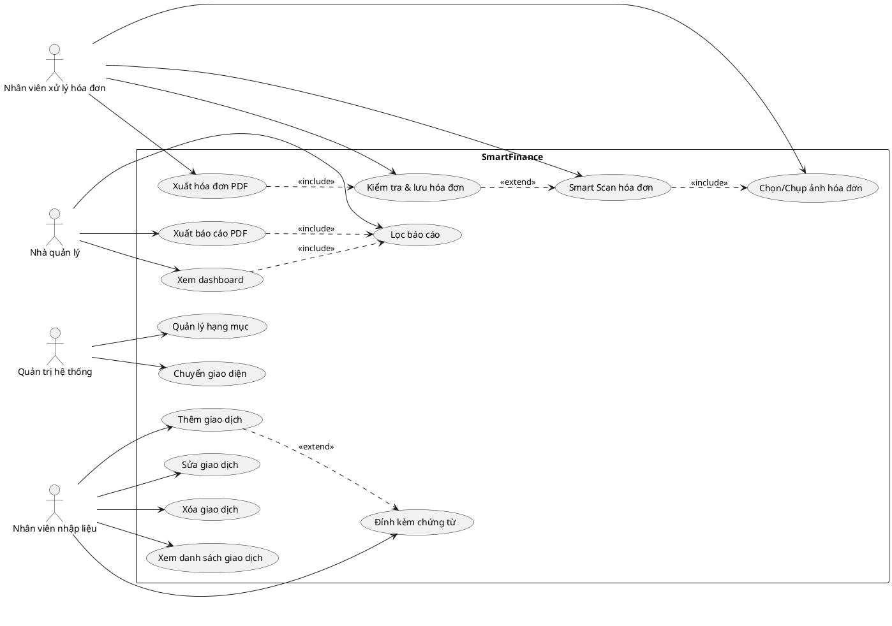

# 05_USE_CASES.md
# SmartFinance Use Cases

## 1. Actors

### Data Entry Staff
Creates, edits, deletes, filters, and attaches receipts to transactions.

### Invoice Staff
Uploads invoice image, runs Smart Scan, reviews invoice data, saves invoices, and exports invoice PDFs.

### Manager
Views dashboard, filters reports, analyzes charts, and exports cash-flow reports.

### Admin
Manages categories, settings, theme mode, and demo data.

---

## 2. Use Case List

| ID | Use Case | Primary Actor |
|---|---|---|
| UC01 | View transaction list | Data Entry Staff |
| UC02 | Add transaction | Data Entry Staff |
| UC03 | Edit transaction | Data Entry Staff |
| UC04 | Delete transaction | Data Entry Staff |
| UC05 | Attach receipt | Data Entry Staff |
| UC06 | Manage categories | Admin |
| UC07 | Select/capture invoice image | Invoice Staff |
| UC08 | Smart Scan invoice | Invoice Staff |
| UC09 | Review and save invoice | Invoice Staff |
| UC10 | Export invoice PDF | Invoice Staff |
| UC11 | View dashboard | Manager |
| UC12 | Filter dashboard/report | Manager |
| UC13 | Export report PDF | Manager |
| UC14 | Change theme | Admin/User |

---

## 3. Use Case Details

## UC01 - View Transaction List

Primary actor: Data Entry Staff

Goal: View all valid transactions.

Preconditions:

- App is opened.
- Local database is initialized.

Main flow:

1. User opens Transactions screen.
2. System loads transactions from local database.
3. System hides transactions with status `deleted` by default.
4. System displays data as cards on mobile or table on desktop.
5. User can filter, search, or open a transaction.

Postconditions:

- Transaction list is visible.

Alternative flows:

- No data → show empty state.
- Load failed → show error and retry button.

---

## UC02 - Add Transaction

Primary actor: Data Entry Staff

Goal: Create a new income or expense transaction.

Preconditions:

- Category list exists.

Main flow:

1. User taps Add Transaction.
2. System opens transaction form.
3. User enters amount.
4. User selects income or expense.
5. User selects category.
6. User selects date.
7. User optionally adds note and receipt.
8. User taps Save.
9. System validates data.
10. System saves transaction as `confirmed`.
11. System updates list and dashboard.

Postconditions:

- New transaction exists in local database.

Exceptions:

- Invalid amount → show validation error.
- Missing category → show validation error.
- Save failed → show error message.

---

## UC03 - Edit Transaction

Primary actor: Data Entry Staff

Goal: Update existing transaction.

Preconditions:

- Transaction exists and is not deleted.

Main flow:

1. User selects transaction.
2. System opens edit form with current data.
3. User changes fields.
4. User taps Save.
5. System validates data.
6. System updates transaction.
7. System recalculates dashboard.

Postconditions:

- Transaction data is updated.

---

## UC04 - Delete Transaction

Primary actor: Data Entry Staff

Goal: Remove transaction from active records.

Preconditions:

- Transaction exists.

Main flow:

1. User swipes transaction or taps delete.
2. System asks for confirmation or shows undo option.
3. User confirms.
4. System changes transaction status to `deleted`.
5. System refreshes list and dashboard.

Postconditions:

- Transaction is excluded from reports.

---

## UC05 - Attach Receipt

Primary actor: Data Entry Staff

Goal: Attach evidence image to transaction.

Main flow:

1. User taps Attach Receipt in transaction form.
2. System opens gallery/camera.
3. User selects or captures image.
4. System stores local file path.
5. System shows image preview.

Postconditions:

- Receipt image is linked to transaction.

---

## UC06 - Manage Categories

Primary actor: Admin

Goal: Maintain income and expense categories.

Main flow:

1. Admin opens Category Management.
2. System displays income/expense categories.
3. Admin adds, edits, or deactivates category.
4. System saves category changes locally.

Rules:

- Category name is required.
- Category type is required.
- Used category should be deactivated, not deleted.

---

## UC07 - Select/Capture Invoice Image

Primary actor: Invoice Staff

Goal: Provide image for Smart Scan.

Main flow:

1. User opens Invoice Scan screen.
2. User selects gallery or camera.
3. User chooses/captures image.
4. System shows preview.
5. System changes scan state to `imageSelected`.

Exceptions:

- Permission denied → show permission message.
- User cancels → return to previous state.

---

## UC08 - Smart Scan Invoice

Primary actor: Invoice Staff

Goal: Simulate AI OCR invoice extraction.

Preconditions:

- Invoice image is selected.

Main flow:

1. User taps Smart Scan.
2. System enters `scanning` state.
3. System displays scanning animation for around 2 seconds.
4. Mock OCR service returns extracted data.
5. System fills invoice form.
6. System changes state to `extracted`.

Exceptions:

- No image selected → show warning.
- Mock scan fails → state becomes `failed`.

---

## UC09 - Review and Save Invoice

Primary actor: Invoice Staff

Goal: Save verified invoice data.

Main flow:

1. User reviews extracted invoice data.
2. User edits fields if needed.
3. User taps Save Invoice.
4. System validates fields.
5. System recalculates VAT and total.
6. System saves invoice locally.

Postconditions:

- Invoice exists in local database.

---

## UC10 - Export Invoice PDF

Primary actor: Invoice Staff

Goal: Generate invoice PDF.

Preconditions:

- Invoice data is valid.

Main flow:

1. User opens Invoice Preview.
2. User taps Export PDF.
3. System builds PDF document.
4. System opens print/share dialog.

Postconditions:

- PDF is generated.

---

## UC11 - View Dashboard

Primary actor: Manager

Goal: View financial overview.

Main flow:

1. Manager opens Dashboard.
2. System loads confirmed transactions.
3. System applies default date filter.
4. System calculates total income, total expense, net cash flow, and expense ratio.
5. System renders KPI cards and charts.

Postconditions:

- Manager sees current financial overview.

---

## UC12 - Filter Dashboard/Report

Primary actor: Manager

Goal: Change report period.

Main flow:

1. Manager selects a time filter.
2. System determines start and end date.
3. System filters transactions.
4. System recalculates dashboard/report.
5. UI updates.

Exceptions:

- Invalid custom range → show error.

---

## UC13 - Export Report PDF

Primary actor: Manager

Goal: Generate cash-flow report PDF.

Main flow:

1. Manager opens Report screen.
2. Manager selects period.
3. System shows report preview.
4. Manager taps Export PDF.
5. System generates PDF.
6. System opens print/share dialog.

---

## UC14 - Change Theme

Primary actor: Admin/User

Goal: Change application appearance.

Main flow:

1. User opens Settings.
2. User selects light, dark, or system mode.
3. System saves setting locally.
4. UI updates.

---

## 4. PlantUML Use Case Diagram

