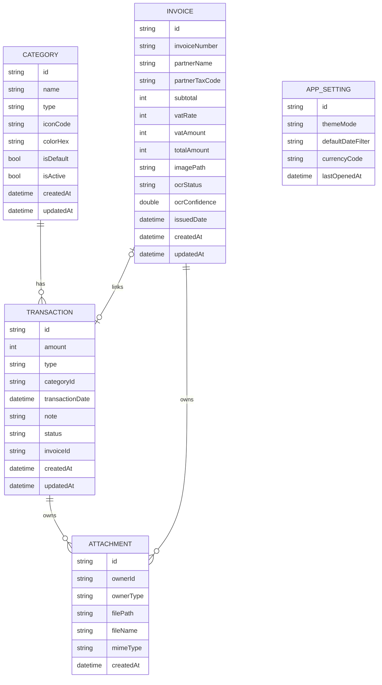

# 06_DATA_MODEL_DATABASE.md
# SmartFinance Data Model and Database Design

## 1. Database Strategy
SmartFinance is an offline-first Flutter app. The database should be local-first.

Recommended options:

- Hive: easier setup, good for simple storage.
- Isar: better querying, better for a one-month project and future growth.

Preferred for maintainable project:

```text
Isar local database
```

Acceptable simplified version:

```text
Hive local database
```

## 2. Core Entities

Minimum required entities:

- Category
- Transaction
- Invoice

Recommended extended entities:

- Attachment
- AppSetting
- ReportSummary model, computed at runtime

## 3. Relationship Overview

```text
Category 1 ---- n Transaction
Invoice 0..1 ---- 0..1 Transaction
Transaction 1 ---- n Attachment
Invoice 1 ---- n Attachment
AppSetting independent
ReportSummary computed from Transaction + Category
```

## 4. Category Entity

Purpose: stores income and expense categories.

| Field | Type | Required | Notes |
|---|---|---|---|
| id | String | Yes | Unique category ID |
| name | String | Yes | Category name |
| type | String | Yes | income or expense |
| iconCode | String? | No | UI icon code |
| colorHex | String? | No | UI color |
| isDefault | bool | Yes | Default category flag |
| isActive | bool | Yes | Active/inactive flag |
| createdAt | DateTime | Yes | Created timestamp |
| updatedAt | DateTime | Yes | Updated timestamp |

Rules:

- name cannot be empty.
- type must be income or expense.
- categories used by transactions should not be hard-deleted.

Default data:

```text
Income:
- Doanh thu bán hàng
- Doanh thu dịch vụ
- Khoản thu khác

Expense:
- Lương
- Mặt bằng
- Marketing
- Mua hàng
- Vận hành
- Điện nước
- Phần mềm
- Chi phí khác
```

## 5. Transaction Entity

Purpose: stores cash-flow records.

| Field | Type | Required | Notes |
|---|---|---|---|
| id | String | Yes | Unique transaction ID |
| amount | int | Yes | VND amount stored as integer |
| type | String | Yes | income or expense |
| categoryId | String | Yes | Reference to Category |
| transactionDate | DateTime | Yes | Business date |
| note | String? | No | Optional note |
| status | String | Yes | draft, confirmed, deleted |
| invoiceId | String? | No | Optional linked invoice |
| createdAt | DateTime | Yes | Created timestamp |
| updatedAt | DateTime | Yes | Updated timestamp |

Rules:

- amount > 0
- amount is int
- type in [income, expense]
- categoryId must exist
- status in [draft, confirmed, deleted]
- only confirmed transactions count in reports

Example:

```json
{
  "id": "trx_001",
  "amount": 15000000,
  "type": "income",
  "categoryId": "cat_income_sales",
  "transactionDate": "2026-06-10",
  "status": "confirmed"
}
```

## 6. Invoice Entity

Purpose: stores invoice information from manual input or Smart Scan mock.

| Field | Type | Required | Notes |
|---|---|---|---|
| id | String | Yes | Unique invoice ID |
| invoiceNumber | String | Yes | Invoice number |
| partnerName | String | Yes | Partner company/person |
| partnerTaxCode | String | Yes | Tax code |
| subtotal | int | Yes | Amount before VAT |
| vatRate | int | Yes | 8 or 10 |
| vatAmount | int | Yes | subtotal * vatRate / 100 |
| totalAmount | int | Yes | subtotal + vatAmount |
| imagePath | String? | No | Local invoice image path |
| ocrStatus | String | Yes | notStarted, imageSelected, scanning, extracted, failed |
| ocrConfidence | double? | No | Mock confidence score |
| issuedDate | DateTime | Yes | Invoice date |
| createdAt | DateTime | Yes | Created timestamp |
| updatedAt | DateTime | Yes | Updated timestamp |

Rules:

- subtotal > 0
- vatRate in [8, 10]
- vatAmount recalculated before save
- totalAmount recalculated before save
- partnerTaxCode cannot be empty

Example:

```json
{
  "id": "inv_001",
  "invoiceNumber": "INV-2026-001",
  "partnerName": "Công ty TNHH Minh An",
  "partnerTaxCode": "0101234567",
  "subtotal": 2500000,
  "vatRate": 10,
  "vatAmount": 250000,
  "totalAmount": 2750000,
  "ocrStatus": "extracted"
}
```

## 7. Attachment Entity

Purpose: stores file metadata for receipt/invoice images.

| Field | Type | Required | Notes |
|---|---|---|---|
| id | String | Yes | Unique attachment ID |
| ownerId | String | Yes | Transaction or Invoice ID |
| ownerType | String | Yes | transaction or invoice |
| filePath | String | Yes | Local file path |
| fileName | String? | No | Original file name |
| mimeType | String? | No | File MIME type |
| createdAt | DateTime | Yes | Created timestamp |

Rules:

- ownerType in [transaction, invoice]
- filePath cannot be empty
- store path, not large binary content in transaction/invoice object

## 8. AppSetting Entity

Purpose: stores app preferences.

| Field | Type | Required | Notes |
|---|---|---|---|
| id | String | Yes | Setting ID |
| themeMode | String | Yes | light, dark, system |
| defaultDateFilter | String? | No | Default dashboard filter |
| currencyCode | String | Yes | VND |
| lastOpenedAt | DateTime? | No | Last opened timestamp |

## 9. ReportSummary Model

This is a computed model, not necessarily persisted.

| Field | Type | Notes |
|---|---|---|
| totalIncome | int | Sum of income transactions |
| totalExpense | int | Sum of expense transactions |
| netCashFlow | int | income - expense |
| expenseRatio | double | expense / income * 100 |
| transactionCount | int | Valid transaction count |
| topExpenseCategoryName | String? | Largest expense category |
| periodStart | DateTime | Report start |
| periodEnd | DateTime | Report end |

## 10. Mermaid ERD



## 11. Dart Entity Examples

### Transaction

```dart
enum TransactionType { income, expense }
enum TransactionStatus { draft, confirmed, deleted }

class TransactionEntity {
  final String id;
  final int amount;
  final TransactionType type;
  final String categoryId;
  final DateTime transactionDate;
  final String? note;
  final TransactionStatus status;
  final String? invoiceId;
  final DateTime createdAt;
  final DateTime updatedAt;

  const TransactionEntity({
    required this.id,
    required this.amount,
    required this.type,
    required this.categoryId,
    required this.transactionDate,
    required this.status,
    required this.createdAt,
    required this.updatedAt,
    this.note,
    this.invoiceId,
  });
}
```

### Invoice

```dart
enum OcrStatus { notStarted, imageSelected, scanning, extracted, failed }

class InvoiceEntity {
  final String id;
  final String invoiceNumber;
  final String partnerName;
  final String partnerTaxCode;
  final int subtotal;
  final int vatRate;
  final int vatAmount;
  final int totalAmount;
  final String? imagePath;
  final OcrStatus ocrStatus;
  final double? ocrConfidence;
  final DateTime issuedDate;
  final DateTime createdAt;
  final DateTime updatedAt;

  const InvoiceEntity({
    required this.id,
    required this.invoiceNumber,
    required this.partnerName,
    required this.partnerTaxCode,
    required this.subtotal,
    required this.vatRate,
    required this.vatAmount,
    required this.totalAmount,
    required this.ocrStatus,
    required this.issuedDate,
    required this.createdAt,
    required this.updatedAt,
    this.imagePath,
    this.ocrConfidence,
  });
}
```
