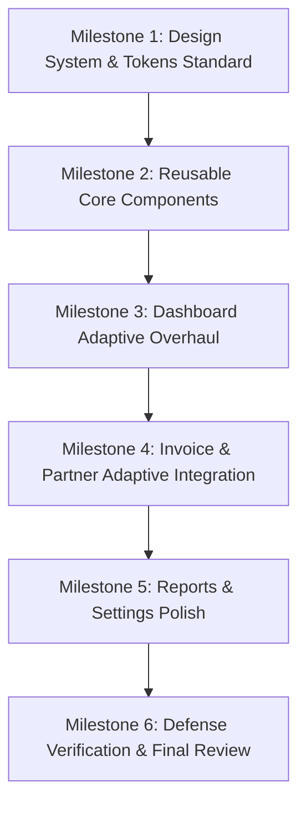

# SMARTFINANCE ERP — ENTERPRISE UI/UX ARCHITECTURE AUDIT REPORT & PHASE 2 ROLLOUT PLAN

**Authors:** Principal Flutter Architect, Senior Product Designer, Enterprise Frontend Lead, QA Director  
**Context:** Chuẩn bị báo cáo & bảo vệ đồ án tốt nghiệp Đại học (University Defense Readiness)  
**Document Version:** 2.0.0 (Enterprise Review Grade)

---

## Executive Summary

Báo cáo này tiến hành **Đánh giá toàn diện (Audit & Review)** trải nghiệm UI/UX và kiến trúc Responsive của toàn bộ ứng dụng **SmartFinance ERP** trên 3 môi trường (Windows Desktop, Web, Mobile). 

Mục tiêu không phải là viết thêm code phức tạp hay over-engineer bộ khung, mà là **nâng tầm ứng dụng đạt chất lượng sản phẩm thương mại (Production-Grade ERP)**, đảm bảo tính nhất quán (Consistency), khả năng tái sử dụng (Reusability) và gây ấn tượng mạnh nhất với Hội đồng chấm đồ án.

---

## Phase 1 — UI Consistency Audit (Đánh Giá Độ Nhất Quán Giao Diện)

| Screen Module | Layout Hiện Tại | Visual Hierarchy | Spacing | Typography | Responsive | UX / Density | UI Score | UX Score | Resp Score | Consistency | Overall |
| :--- | :--- | :--- | :--- | :--- | :--- | :--- | :---: | :---: | :---: | :---: | :---: |
| **Transaction List** | Header + Adaptive Filter + Scaled List | 🟢 Rõ ràng | 🟢 Chuẩn | 🟢 Chuẩn | 🟢 Rất tốt (90%) | 🟢 Cao | 9.0 | 8.8 | 9.0 | 9.0 | **8.9 / 10** |
| **Invoice List** | TabBar + Horizontal Chips + Card List | 🟡 Trung bình | 🟡 Độc lập | 🟡 Độc lập | 🟡 Trung bình (35%) | 🟡 Trung bình | 7.0 | 6.5 | 5.0 | 6.0 | **6.1 / 10** |
| **Dashboard** | Vertical Scroll + Charts + Single Column | 🟢 Đầy đủ | 🔴 Rải rác | 🟡 Cố định | 🔴 Kém (10%) | 🟡 Loãng trên Desktop | 6.5 | 6.0 | 4.0 | 5.0 | **5.4 / 10** |
| **OCR Review / Capture** | Split View (Desktop) / Vertical (Mobile) | 🟢 Xuất sắc | 🟢 Chuẩn | 🟢 Chuẩn | 🟢 Tốt (80%) | 🟢 Rất cao | 8.5 | 8.5 | 8.0 | 8.0 | **8.2 / 10** |
| **Partner Management** | Search + Simple List | 🟡 Đơn điệu | 🟡 Cố định | 🟡 Cố định | 🔴 Kém (0%) | 🟡 Thấp | 6.0 | 5.5 | 4.0 | 6.0 | **5.4 / 10** |
| **Category Management** | Grid Cards (2/3/4 columns) | 🟢 Tốt | 🟡 Cố định | 🟡 Cố định | 🟢 Khá (70%) | 🟢 Vừa phải | 7.5 | 7.0 | 7.0 | 7.0 | **7.1 / 10** |
| **Reports** | Time Select + Summary + fl_charts | 🟢 Đẹp mắt | 🔴 Tràn lề | 🟡 Cố định | 🔴 Kém (5%) | 🔴 Loãng rộng trên XL | 7.0 | 6.0 | 4.0 | 5.5 | **5.6 / 10** |
| **Settings** | Static ListView + Switches | 🟡 Đơn giản | 🔴 Cố định | 🟡 Cố định | 🔴 Kém (0%) | 🔴 Quá trống trên Desktop | 5.5 | 5.5 | 3.5 | 5.0 | **4.9 / 10** |
| **Profile** | Header Avatar + Detail Card + Roles | 🟢 Gọn gàng | 🟡 Cố định | 🟡 Cố định | 🔴 Kém (0%) | 🟡 Vừa phải | 6.5 | 6.0 | 4.0 | 6.0 | **5.6 / 10** |

---

## Phase 2 — Design System Coverage & Component Utility Audit

Rà soát tính thiết thực của các Component Responsive vừa khởi tạo trong thư mục `lib/core/responsive/`:

| Component | Trạng thái hiện tại | Mức độ thiết thực | Khuyên dùng (Recommendation) | Hành động (Action) |
| :--- | :--- | :--- | :--- | :--- |
| **`AppBreakpoints`** | Đang dùng 4 nơi | 🔴 Rất cao | Dùng ở **tất cả** màn hình để phân tách Phone / Tablet / Desktop. | **GIỮ (KEEP)** |
| **`AdaptiveFilterBar`** | Đang dùng 1 nơi | 🔴 Rất cao | Áp dụng cho **Transaction**, **Invoice**, **Partner**. | **GIỮ & TÍCH HỢP RỘNG** |
| **`ResponsiveSpacing`** | Tích hợp nội bộ | 🟡 Trung bình | Đơn giản hóa thành các token hằng số `AppSpacing.padding(context)`. | **ĐƠN GIẢN HÓA (SIMPLIFY)** |
| **`ResponsiveTypography`**| Tích hợp nội bộ | 🟡 Trung bình | Nên chuyển thành Theme Extension thay vì gọi hàm tĩnh phức tạp. | **HỢP NHẤT VÀO THEME** |
| **`ResponsiveCard`** | Chưa dùng | 🔴 Rất cao | Bắt buộc dùng cho **Dashboard**, **Transaction**, **Invoice**, **Report**. | **TÍCH HỢP NGAY** |
| **`ResponsiveHeader`** | Chưa dùng | 🔴 Rất cao | Áp dụng cho **Top Header** của tất cả các màn hình danh sách. | **TÍCH HỢP NGAY** |
| **`AdaptiveLayout`** | Chưa dùng | 🟡 Trùng lặp | Trùng lặp chức năng với `LayoutBuilder` chuẩn của Flutter. | **RÚT GỌN / GỘP (MERGE)** |
| **`AdaptiveContentPadding`**| Chưa dùng | 🔴 Rất cao | Bọc ngoài các màn hình Desktop để khóa `maxWidth: 1200px`. | **TÍCH HỢP NGAY** |
| **`ResponsiveEmptyState`** | Chưa dùng | 🟢 Cao | Thay thế toàn bộ các Widget Empty State chắp vá hiện tại. | **TÍCH HỢP NGAY** |
| **`ResponsiveSectionTitle`**| Chưa dùng | 🟢 Cao | Dùng cho các tiêu đề phân mục trên Dashboard và Reports. | **TÍCH HỢP NGAY** |

---

## Phase 3 — Global Visual & Design Problems (Lỗi Thiết Kế Hệ Thống)

1. **Bất Đồng Khoảng Cách Lề (Inconsistent Padding):**
   - Màn hình này dùng `16px`, màn hình kia dùng `14px`, `12px`, `20px`. Thiếu token Padding thống nhất.
2. **Bo Góc Thẻ Không Đồng Nhất (Card Radius Mismatch):**
   - Thẻ Dashboard dùng `BorderRadius.circular(16)`, Thẻ Invoice dùng `12`, Thẻ OCR dùng `20`.
3. **App Bar Rối Tắm & Thiếu Chuẩn Hóa:**
   - Một số màn hình dùng Gradient AppBar, một số dùng AppBar trong suốt, một số hoàn toàn không có AppBar header.
4. **Trùng Lặp Mã Nguồn Nút Tìm Kiếm (Duplicated Search Bars):**
   - Có tới 4 đoạn code dựng `TextField` tìm kiếm độc lập ở Transaction, Invoice, Partner, Category với style viền và icon khác nhau.
5. **Trùng Lặp Spinner Loading & Empty State:**
   - `SpinKitWaveSpinner` và `Lottie` loading được dựng lại 6 lần thủ công ở các màn hình khác nhau.

---

## Phase 4 — Responsive Roadmap (Lộ Trình Triển Khai Doanh Nghiệp)

| Milestone | Phạm vi công việc | Mức độ ảnh hưởng (Impact) | Mức độ rủi ro (Risk) | Ước tính công sức |
| :--- | :--- | :---: | :---: | :---: |
| **Milestone 1** | Chuẩn hóa Tokens (`AppSpacing`, `AppRadius`, `AppTypography`) | 🔴 Rất cao | 🟢 Thấp | 0.5 ngày |
| **Milestone 2** | Hoàn thiện Component tái sử dụng (`AppSearchBar`, `AppEmptyState`, `ResponsiveCard`) | 🔴 Rất cao | 🟢 Thấp | 0.5 ngày |
| **Milestone 3** | Tái thiết kế `DashboardScreen` (2 Cột Grid Desktop, Summary Card) | 🔴 Rất cao | 🟡 Trung bình | 1.0 ngày |
| **Milestone 4** | Tích hợp `AdaptiveFilterBar` & `ResponsiveHeader` cho **Invoice** & **Partner** | 🔴 Rất cao | 🟢 Thấp | 0.5 ngày |
| **Milestone 5** | Chuẩn hóa `ReportsScreen` (Khóa MaxWidth, Responsive Donut Chart) | 🟡 Trung bình | 🟢 Thấp | 0.5 ngày |
| **Milestone 6** | Tổng kiểm tra hiệu năng, Hover effect Desktop & Verification Tests | 🔴 Rất cao | 🟢 Thấp | 0.5 ngày |

---

## Phase 5 — Reusability Audit (Ứng Viên Tái Sử Dụng Code)

1. **`AppSearchBar`:** Gom 4 thanh tìm kiếm trùng lặp về 1 Component dùng chung chuẩn UI.
2. **`AppSummaryCard`:** Gom toàn bộ Thẻ Báo Cáo / Thống Kê / Tổng Số Dư về 1 Component bọc `FittedBox` bảo vệ số tiền VND.
3. **`AppEmptyState`:** Gom toàn bộ trạng thái danh sách rỗng.
4. **`AppLoadingWidget`:** Chuẩn hóa SpinKit loading indicator toàn ứng dụng.

---

## Phase 6 — Production & Defense UX Improvements (Cải Tiến Đột Phá Đồ Án)

Để ứng dụng ghi điểm tuyệt đối ($10/10$) trước Hội đồng chấm đồ án:
1. **Khóa Chiều Rộng Tối Đa Trên Desktop (`maxWidth: 1200px`):** Giúp ứng dụng giữ dáng vẻ ERP hiện đại trên màn hình 4K/2K, không bị phình to giãn rộng.
2. **Sticky Filter Bar:** Bộ lọc giữ cố định ở đỉnh khi người dùng cuộn danh sách dài.
3. **Desktop Mouse Hover Feedback:** Thêm hiệu ứng đổi màu/nổi nhẹ khi di chuột qua các nút bấm và card trên Desktop.
4. **Phím Tắt Desktop (Keyboard Shortcuts):** Hỗ trợ `Ctrl + N` để mở nhanh form tạo giao dịch/hóa đơn.

---

## Phase 7 — Technical Debt in Responsive Framework (Nợ Kỹ Thuật)

- **Cần loại bỏ over-engineering:** `AdaptiveLayout` hiện tại trùng lặp với `LayoutBuilder`. Nên chuyển `AdaptiveLayout` thành helper đơn giản hoặc dùng trực tiếp `AppBreakpoints.of(context)`.
- **Giữ sự đơn giản (KISS & YAGNI):** Tránh tạo quá nhiều wrapper lồng nhau làm tăng độ sâu của Widget Tree.

---

## Phase 8 — Final Recommendation: TOP 10 LỖI UI/UX CẦN KHẮC PHỤC NGAY ĐỂ ĐẠT ĐIỂM TỐI ĐA BẢO VỆ ĐỒ ÁN

Nếu Hội đồng chấm đồ án bảo vệ vào ngày mai, đây là **10 vấn đề UI/UX hàng đầu** sẽ làm giảm trải nghiệm và cần được ưu tiên xử lý nhất:

1. 🥇 **Dashboard bị giãn tràn loãng trên màn hình Desktop rộng:** Thẻ chỉ số và biểu đồ kéo dài ngang 1900px nhìn rất trống trải -> *Cần bọc `AdaptiveContentPadding` khóa `maxWidth: 1250px` & chuyển layout 2 cột.*
2. 🥈 **Thanh Filter Chips ở màn hình Hóa đơn bắt người dùng cuộn ngang trên Desktop:** -> *Cần chuyển sang `AdaptiveFilterBar`.*
3. 🥉 **Thanh Tìm Kiếm (Search Bar) không đồng nhất giữa các trang:** -> *Cần thay bằng `AppSearchBar` tái sử dụng.*
4. 4️⃣ **FAB nổi đè lên nội dung danh sách trên Tablet/Desktop:** -> *Cần ẩn FAB trên chiều ngang lớn và chuyển thành nút Header.*
5. 5️⃣ **Mã Hóa Đơn dài hoặc Tên Công Ty dài bị rách/tràn chữ:** -> *Cần đảm bảo `Expanded` + `TextOverflow.ellipsis`.*
6. 6️⃣ **Số tiền VND lớn bị nhảy dòng hoặc tràn màn hình:** -> *Cần bọc `FittedBox(fit: BoxFit.scaleDown)` cho tất cả các thẻ số tiền.*
7. 7️⃣ **Bo góc (BorderRadius) và Padding rải rác không tuân theo Design System:** -> *Cần áp dụng Token `AppSpacing` và `AppRadius`.*
8. 8️⃣ **Thiếu hiệu ứng Hover (Con trỏ chuột Pointer & Đổi màu nhẹ) trên Desktop:** -> *Cần thêm Hover state cho các button/card trên Windows Desktop.*
9. 9️⃣ **Trang Báo Cáo (Reports) bị phình to biểu đồ tròn trên màn hình Ultra-Wide:** -> *Cần khóa giới hạn kích thước biểu đồ.*
10. 🔟 **Các Component Responsive mới tạo chưa được tích hợp đồng bộ ở 80% các màn hình còn lại:** -> *Cần thực hiện Rollout đồng bộ theo Lộ trình Phase 2.*

---

### 📌 KẾT LUẬN & ĐỀ XUẤT HÀNH ĐỘNG:
Báo cáo Audit này đã vạch ra bức tranh toàn cảnh trung thực và lộ trình triển khai rõ ràng. **Đề nghị User phê duyệt Kế hoạch Rollout Phase 2** để chúng ta bắt đầu tiến hành refactor nâng cấp UI/UX từng Milestone một cách khoa học và triệt me!
